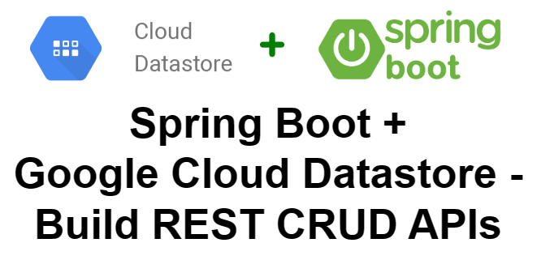
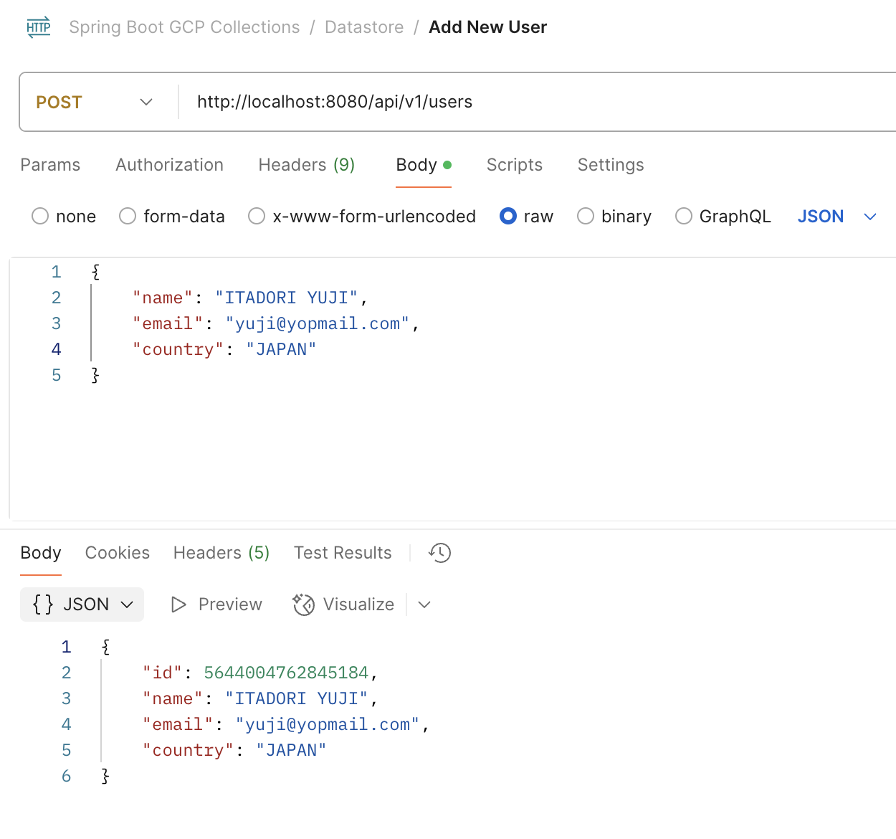
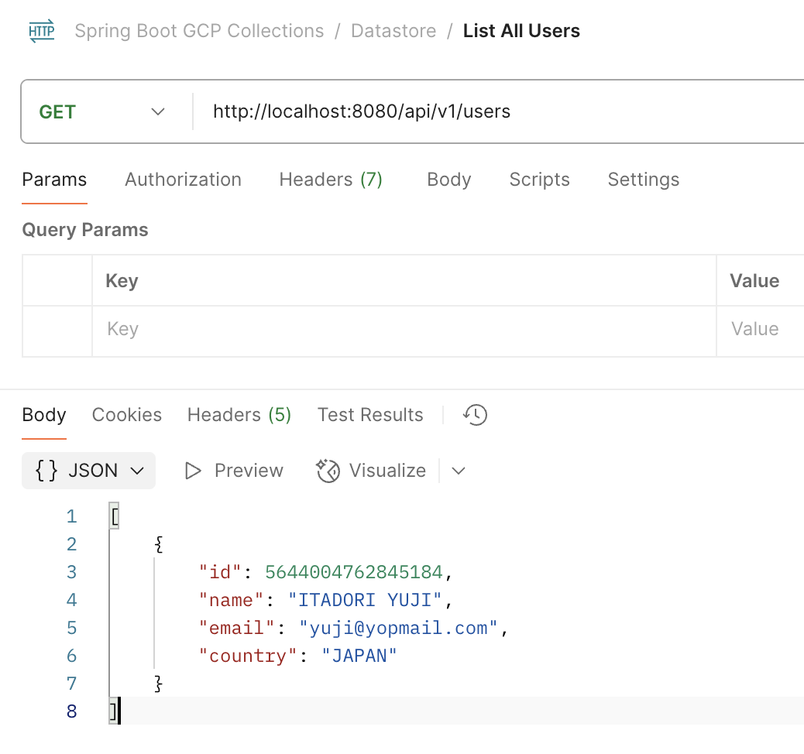
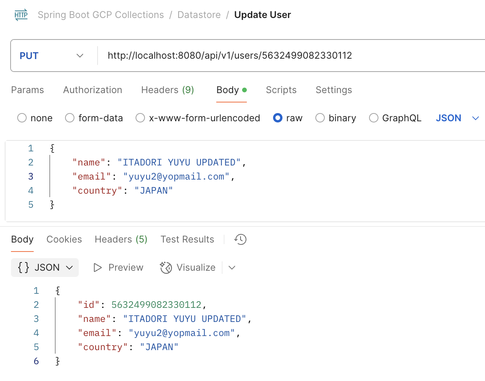
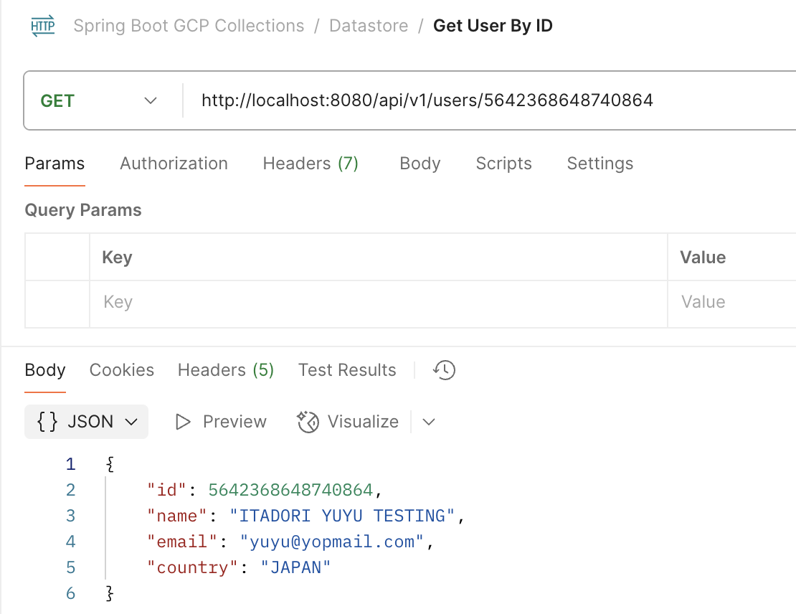
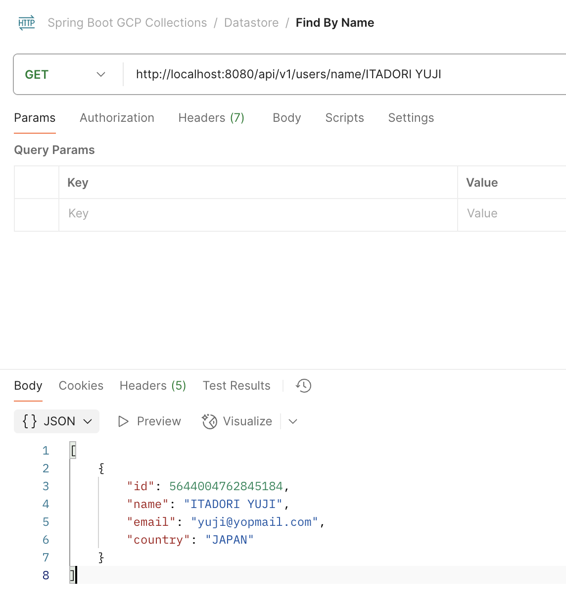
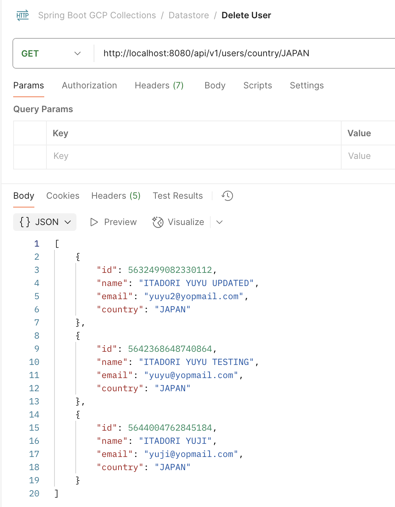
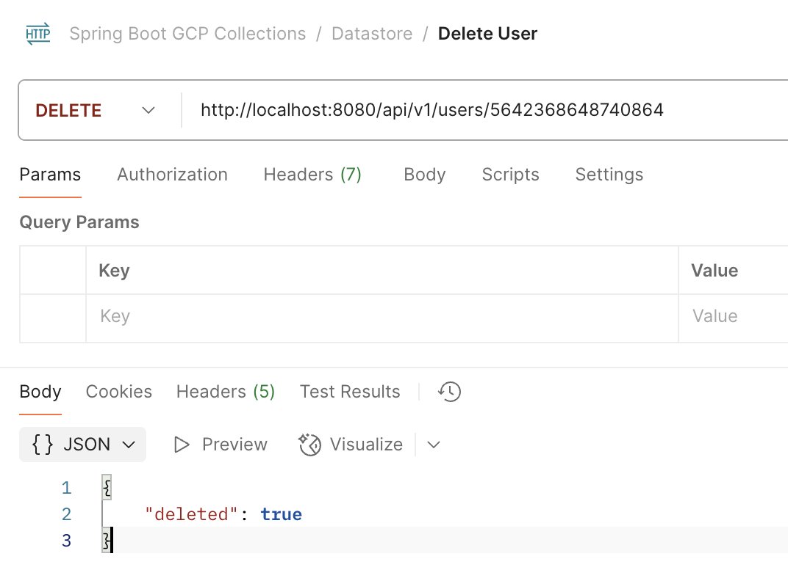

# spring-boot-gcp-datastore

### Things to do list:

1. Clone this repository: `git clone https://github.com/hendisantika/spring-boot-gcp-datastore.git'
2. Go to the folder: `cd spring-boot-gcp-datastore`
3. Setup your GCP Project and enable Datastore API
4. Create a Service Account and download the JSON file
5. Run the application: `mvn clean spring-boot:run`
6. Open your favorite browser: http://localhost:8080/api/v1/users
7. Open your POSTMAN and do the POST request to save the data to Datastore
8. Import the POSTMAN Collection: `spring-boot-gcp-datastore.postman_collection.json`

### Image Screen shot

Add User

List User

Update User

Find User By Id

Find User By Name

Find User By Country

Delete User

